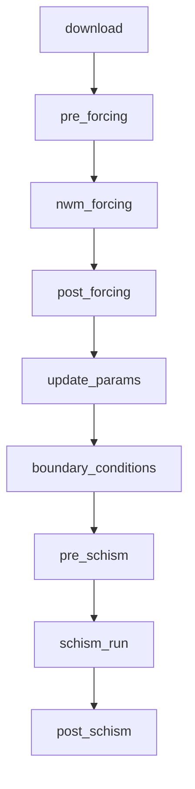

# Design Documentation

## Overview

The `coastal-calibration` Python package is a complete redesign and rewrite of the
original bash-based SCHISM model calibration workflow. This document details the
architectural improvements, design decisions, and substantial enhancements made over the
original implementation.

______________________________________________________________________

## Executive Summary

The `coastal-calibration` package provides a modern Python interface for running SCHISM
model calibration workflows on HPC clusters. It wraps the existing operational workflow
scripts with a clean, type-safe API while establishing the foundation for incremental
improvements.

### Design Goals

The primary objectives of this rewrite are to create a workflow that is:

1. **Intuitive and user-friendly** - Simple YAML configuration, clear CLI commands,
   helpful error messages
1. **Less prone to errors** - Type-safe configuration, comprehensive validation,
   structured logging
1. **Extensible** - Clean stage-based architecture that allows adding new models
   (SFINCS) and features

### Architectural Strategy

The package is designed with a **stable public API** that shields users from internal
changes. This enables:

- **Immediate usability** - Users get a clean interface today, even while internals are
  being improved
- **Incremental rewriting** - Embedded bash scripts can be replaced with pure Python one
  stage at a time
- **Safe evolution** - Internal rewrites don't break user-facing code or configurations

The long-term goal is to **completely rewrite** all embedded bash scripts in Python, but
doing so incrementally allows the package to be useful immediately while that work
proceeds.

### Key Features

- **Type-safe configuration** via `dataclasses` with runtime validation
- **Modular stage-based architecture** for maintainability and extensibility
- **Native Python datetime handling** replacing fragile shell date arithmetic
- **Async data downloading** with built-in source validation
- **CLI and programmatic APIs** for both interactive and automated use
- **SLURM job management** with status monitoring
- **Progress tracking** and structured logging
- **Configuration inheritance** for DRY multi-run setups
- **Smart default paths** with variable interpolation

______________________________________________________________________

## Original Implementation Analysis

### File Structure (20+ scripts)

```console
calib_org/
├── sing_run.bash                     # Main entry point (258 lines)
├── schism_calib.cfg                  # Configuration file
├── pre_nwm_forcing_coastal.bash      # Forcing preparation
├── post_nwm_forcing_coastal.bash     # Forcing post-processing
├── make_tpxo_ocean.bash              # TPXO boundary conditions
├── pre_regrid_stofs.bash             # STOFS pre-processing
├── post_regrid_stofs.bash            # STOFS post-processing
├── update_param.bash                 # Parameter file updates (249 lines)
├── pre_schism.bash                   # SCHISM input preparation
├── post_schism.bash                  # SCHISM output processing
├── merge_source_sink.bash            # Discharge file merging
├── initial_discharge.bash            # Initial discharge creation
├── combine_sink_source.bash          # Sink/source combination
└── run_sing_coastal_workflow_*.bash  # 8+ Singularity wrappers
```

### Critical Issues in Original Implementation

#### 1. Fragile Date Arithmetic

The original workflow relied on external scripts for date calculations:

```bash
# Original: External script calls for every date operation
export FORCING_END_DATE=$(${USHnwm}/utils/advance_time.sh $PDY$cyc $LENGTH_HRS)'00'
pdycyc=$(${USHnwm}/utils/advance_time.sh $PDY$cyc $hr)
```

This approach had several problems:

- Required external `advance_time.sh` and `advance_cymdh.pl` scripts
- Shell spawning overhead for each date operation
- Inconsistent handling of edge cases (leap years, month boundaries)
- No error handling for invalid dates

#### 2. Environment Variable Pitfalls

The original scripts passed dozens of environment variables between scripts:

```bash
# Original configuration (schism_calib.cfg)
export STARTPDY=20230611
export STARTCYC=00
export FCST_LENGTH_HRS=3.0
export HOT_START_FILE=''
export USE_TPXO="NO"
export COASTAL_DOMAIN=pacific
export METEO_SOURCE=NWM_RETRO
export COASTAL_WORK_DIR=/efs/schism_use_case/...

# Plus 40+ more in sing_run.bash
```

Problems:

- No validation of variable values
- Easy to have typos that fail silently
- Difficult to track variable dependencies
- No documentation of which variables are required vs optional

#### 3. String-Based Domain Mapping

```bash
# Original: Repeated in multiple files
declare -A coastal_domain_to_inland_domain=( \
    [prvi]="domain_puertorico" \
    [hawaii]="domain_hawaii" \
    [atlgulf]="domain" \
    [pacific]="domain" )
```

Problems:

- Duplicated across multiple scripts
- No compile-time type checking
- Silent failures on unknown domains

#### 4. No Data Download Integration

The original workflow required manual data downloading via a separate workflow. That
workflow had no date validation, no source awareness, and no progress tracking.

#### 5. Minimal Error Handling

```bash
# Original: Scripts would continue on failure
singularity exec -B $BINDINGS --pwd ${work_dir} $SIF_PATH \
    ./run_sing_coastal_workflow_pre_forcing_coastal.bash
# No error check here
```

______________________________________________________________________

## New Architecture

### Package Structure

```console
src/coastal_calibration/
├── __init__.py                  # Package exports
├── cli.py                       # Command-line interface
├── runner.py                    # Main workflow orchestrator
├── _time_utils.py               # Private datetime utilities
├── workflow_utils.py            # Workflow utility functions
├── downloader.py                # Async data downloading
├── scripts_path.py              # Script path management
│
├── config/
│   ├── __init__.py
│   └── schema.py                # YAML config dataclasses
│
├── stages/                      # Workflow stages
│   ├── __init__.py
│   ├── base.py                  # Abstract WorkflowStage base class
│   ├── download.py              # Data download stage
│   ├── forcing.py               # NWM forcing stages
│   ├── boundary.py              # Boundary condition stages
│   ├── schism.py                # SCHISM execution stages
│   └── sfincs.py                # SFINCS infrastructure (future)
│
├── scripts/                     # Embedded bash scripts
│   ├── tpxo_to_open_bnds_hgrid/ # TPXO Python utilities
│   └── wrf_hydro_workflow_dev/  # WRF-Hydro forcing code
│
└── utils/
    ├── __init__.py
    ├── logging.py               # Workflow monitoring
    └── slurm.py                 # SLURM job management
```

### Core Components

#### 1. Configuration System (`config/schema.py`)

The new configuration system uses Python `dataclasses` with full type hints:

```python
from dataclasses import dataclass
from typing import Literal

CoastalDomain = Literal["prvi", "hawaii", "atlgulf", "pacific"]
MeteoSource = Literal["nwm_retro", "nwm_ana"]
BoundarySource = Literal["tpxo", "stofs"]


@dataclass
class SimulationConfig:
    """Simulation time and domain configuration."""

    start_date: datetime
    duration_hours: int
    coastal_domain: CoastalDomain
    meteo_source: MeteoSource
    timestep_seconds: int = 3600

    # Domain mappings as class variables
    _INLAND_DOMAIN: ClassVar[dict[str, str]] = {
        "prvi": "domain_puertorico",
        "hawaii": "domain_hawaii",
        "atlgulf": "domain",
        "pacific": "domain",
    }

    @property
    def inland_domain(self) -> str:
        """Inland domain directory name for this coastal domain."""
        return self._INLAND_DOMAIN[self.coastal_domain]
```

Benefits:

- **Type safety**: IDE autocompletion, static analysis with `pyright`
- **Self-documenting**: Property names and docstrings explain purpose
- **Validation**: Runtime checks with helpful error messages
- **DRY**: Domain mappings defined once

#### 2. YAML Configuration with Smart Defaults

The configuration system supports variable interpolation and automatic path generation:

```yaml
# Minimal configuration - paths are auto-generated
slurm:
  job_name: my_schism_run
  user: your_username

simulation:
  start_date: '2021-06-11'
  duration_hours: 24
  coastal_domain: hawaii
  meteo_source: nwm_ana

boundary:
  source: stofs
```

When paths are not specified, they are automatically generated using templates:

```python
DEFAULT_WORK_DIR_TEMPLATE = (
    "/ngen-test/coastal/${slurm.user}/"
    "schism_${simulation.coastal_domain}_${boundary.source}_${simulation.meteo_source}/"
    "schism_${simulation.start_date}"
)

DEFAULT_RAW_DOWNLOAD_DIR_TEMPLATE = (
    "/ngen-test/coastal/${slurm.user}/"
    "schism_${simulation.coastal_domain}_${boundary.source}_${simulation.meteo_source}/"
    "raw_data"
)
```

Features:

- **Variable interpolation**: `${section.key}` syntax
- **Inheritance**: `_base` field for configuration reuse
- **Deep merging**: Override only what changes
- **Smart defaults**: Minimal configuration required

#### 3. Stage-Based Workflow Architecture



Each stage is a Python class inheriting from `WorkflowStage`:

```python
class WorkflowStage(ABC):
    """Abstract base class for workflow stages."""

    name: str = "base"
    description: str = "Base workflow stage"

    def __init__(self, config: CoastalCalibConfig, monitor: WorkflowMonitor | None):
        self.config = config
        self.monitor = monitor

    def build_environment(self) -> dict[str, str]:
        """Build environment variables for the stage."""
        # Converts config to env vars for bash scripts
        env = os.environ.copy()
        env["STARTPDY"] = self.config.simulation.start_pdy
        env["STARTCYC"] = self.config.simulation.start_cyc
        # ... all precomputed, no shell date arithmetic needed
        return env

    @abstractmethod
    def run(self) -> dict[str, Any]:
        """Execute the stage and return results."""
        pass

    def validate(self) -> list[str]:
        """Validate stage prerequisites. Return list of errors."""
        return []
```

#### 4. Workflow Runner Orchestration

```python
class CoastalCalibRunner:
    """Main workflow runner for coastal model calibration."""

    STAGE_ORDER: ClassVar[list[str]] = [
        "download",
        "pre_forcing",
        "nwm_forcing",
        "post_forcing",
        "update_params",
        "boundary_conditions",
        "pre_schism",
        "schism_run",
        "post_schism",
    ]

    def run(
        self,
        start_from: str | None = None,
        stop_after: str | None = None,
    ) -> WorkflowResult:
        """Execute the calibration workflow."""
        pass

    def submit(self, wait: bool = False) -> WorkflowResult:
        """Submit workflow as a SLURM job.

        Parameters
        ----------
        wait : bool
            If True, wait for job completion with status updates.
            If False (default), return immediately after submission.
        """
        pass
```

______________________________________________________________________

## Key Design Decisions

### 1. Python-Native Date Arithmetic

**Decision**: Replace all bash/Perl date scripts with Python `datetime`.

**Rationale**:

- Python's `datetime` and `timedelta` handle all edge cases correctly
- No external dependencies or shell spawning
- Type-safe with IDE support

**Implementation** (`_time_utils.py` — private module):

```python
_DATE_RE = re.compile(r"^\d{10}$")


def _parse_date(date_string: str) -> datetime:
    """Parse a YYYYMMDDHH string into a datetime, with strict validation."""
    if not isinstance(date_string, str) or not _DATE_RE.match(date_string):
        raise ValueError(
            f"date_string must be exactly 10 digits in YYYYMMDDHH format, got {date_string!r}"
        )
    return datetime.strptime(date_string, "%Y%m%d%H")


def advance_time(date_string: str, hours: int) -> str:
    """Advance a date string by a specified number of hours.

    Replaces advance_time.sh and advance_cymdh.pl with native Python.
    Handles leap years, month boundaries, DST, etc.
    """
    dt = _parse_date(date_string) + timedelta(hours=hours)
    return dt.strftime("%Y%m%d%H")
```

The module also consolidates `parse_datetime()` (flexible datetime parsing, previously
duplicated in `config.schema` and `downloader`) and `iter_hours()` (hour-range
iteration, previously in `downloader`).

### 2. Integrated Data Downloading with Validation

**Decision**: Build a comprehensive downloader with source awareness and date range
validation.

**Rationale**:

- Different data sources have different availability windows
- Users shouldn't waste time on downloads that will fail
- Async downloading is faster than sequential

**Implementation** (`downloader.py`):

```python
DATA_SOURCE_DATE_RANGES: dict[str, dict[str, DateRange]] = {
    "nwm_retro": {
        "conus": DateRange(
            start=datetime(1979, 2, 1),
            end=datetime(2023, 1, 31),
            description="NWM Retrospective 3.0 (CONUS)",
        ),
        # ...
    },
    "stofs": {
        "_default": DateRange(
            start=datetime(2020, 12, 30),
            end=None,  # operational, no end date
            description="STOFS (operational)",
        ),
    },
}
```

### 3. Configuration Over Convention

**Decision**: Use explicit YAML configuration with sensible defaults.

**Rationale**:

- Original relied on implicit conventions (file locations, naming patterns)
- Explicit configuration is self-documenting
- Easier to version control and share

### 4. Non-Interactive Default with Interactive Flag

**Decision**: The `submit` command returns immediately by default, with an optional
`--interactive` (`-i`) flag to wait for completion.

**Rationale**:

- Matches standard `sbatch` behavior that users expect
- Allows users to submit jobs and continue working
- Interactive mode available when monitoring is desired

**CLI behavior**:

```bash
# Default: Submit and return immediately (like sbatch)
coastal-calibration submit config.yaml

# Interactive: Wait for completion with status updates
coastal-calibration submit config.yaml --interactive
coastal-calibration submit config.yaml -i
```

### 5. Stable Public API with Incremental Internal Rewrite

**Decision**: Establish a clean, stable public API while embedding existing scripts as a
transitional measure.

**Strategy**:

The architecture deliberately separates **public API** from **private implementation**:

| Layer                      | Components                                      | Stability |
| -------------------------- | ----------------------------------------------- | --------- |
| **Public API**             | `CoastalCalibConfig`, `CoastalCalibRunner`, CLI | Stable    |
| **Stage Interface**        | `WorkflowStage.run()`, `.validate()`            | Stable    |
| **Private Implementation** | Bash scripts → Pure Python                      | Evolving  |

### 6. Strict Type Checking with `pyright`

**Decision**: Use strict `pyright` mode for static type analysis.

**Rationale**:

- Catches errors before runtime
- Enables IDE features (autocomplete, refactoring)
- Self-documents function signatures

______________________________________________________________________

## Substantial Improvements

### 1. Error Handling and Validation

| Aspect                   | Original        | New                                            |
| ------------------------ | --------------- | ---------------------------------------------- |
| Configuration validation | None            | 12+ checks in `CoastalCalibConfig.validate()`  |
| Stage validation         | None            | Each stage has `validate()` method             |
| Error messages           | Exit codes only | Detailed, actionable messages                  |
| Recovery                 | Manual restart  | Partial workflow execution with `--start-from` |

### 2. Progress Tracking and Monitoring

**Original**: No progress tracking, just log messages scattered in bash scripts.

**New**: Structured monitoring with stage context:

```python
class WorkflowMonitor:
    """Monitors and logs workflow execution progress."""

    @contextmanager
    def stage_context(self, stage_name: str, description: str):
        """Context manager for stage execution with timing."""
        self.info(f"Starting stage: {stage_name} - {description}")
        start = time.perf_counter()
        try:
            yield
            duration = time.perf_counter() - start
            self.info(f"Completed stage: {stage_name} in {duration:.1f}s")
        except Exception:
            raise
```

### 3. SLURM Integration

**Original**: Manual SLURM script writing, no job tracking.

**New**: Full `SlurmManager` class with job monitoring:

```python
class SlurmManager:
    """Manage SLURM job submission and monitoring."""

    def submit_job(self, script_path: Path) -> str:
        """Submit and return job ID."""

    def get_job_status(self, job_id: str) -> JobStatus:
        """Query job status from squeue."""

    def wait_for_job(self, job_id: str, poll_interval: int = 30) -> JobStatus:
        """Block until job completes, logging state transitions."""
```

### 4. CLI with Multiple Entry Points

```bash
# Initialize configuration for a domain
coastal-calibration init config.yaml --domain hawaii

# Validate configuration
coastal-calibration validate config.yaml

# Submit to SLURM (returns immediately)
coastal-calibration submit config.yaml

# Submit and wait for completion
coastal-calibration submit config.yaml -i

# Run partial workflow
coastal-calibration run config.yaml --start-from update_params

# List available stages
coastal-calibration stages
```

### 5. Comprehensive Downloader

| Feature           | Original       | New                               |
| ----------------- | -------------- | --------------------------------- |
| Data sources      | Manual AWS CLI | NWM Retro, NWM Ana, STOFS, GLOFS  |
| Date validation   | None           | Checks against known availability |
| Parallel download | None           | Async with `tiny_retriever`       |
| Skip existing     | None           | `skip_existing=True` option       |
| Progress tracking | None           | Success/failure counts            |

______________________________________________________________________

## API Reference

### Configuration Classes

| Class                | Purpose                           |
| -------------------- | --------------------------------- |
| `CoastalCalibConfig` | Root configuration container      |
| `SlurmConfig`        | SLURM job parameters              |
| `SimulationConfig`   | Time, domain, and source settings |
| `BoundaryConfig`     | TPXO vs STOFS selection           |
| `PathConfig`         | All file and directory paths      |
| `MPIConfig`          | MPI task and threading settings   |
| `MonitoringConfig`   | Logging and progress tracking     |
| `DownloadConfig`     | Data download settings            |

### Workflow Stages

| Stage                 | Description                              |
| --------------------- | ---------------------------------------- |
| `download`            | Download NWM/STOFS/GLOFS data            |
| `pre_forcing`         | Prepare forcing directories and symlinks |
| `nwm_forcing`         | Run WRF-Hydro forcing engine (MPI)       |
| `post_forcing`        | Post-process forcing files               |
| `update_params`       | Generate SCHISM `param.nml`              |
| `boundary_conditions` | TPXO or STOFS boundary generation        |
| `pre_schism`          | Prepare SCHISM inputs                    |
| `schism_run`          | Execute `pschism` binary (MPI)           |
| `post_schism`         | Validate and post-process outputs        |

______________________________________________________________________

## Future Developments

### Near-Term: Complete Python Rewrite

The highest priority is incrementally replacing embedded bash scripts with pure Python
implementations:

1. **Establish Testing Baseline** - Add integration tests capturing current behavior
1. **Incremental Stage Rewriting** - Start with simpler stages
1. **Performance Optimization** - Replace subprocess calls with native Python
1. **Deprecate Bash Scripts** - Remove bash dependencies once Python replacements are
   validated

### Medium-Term: Feature Expansion

1. **SFINCS Model Support** - Infrastructure already in place (`stages/sfincs.py`)
1. **Hot Start Chain Automation** - Automatic hot-start file discovery
1. **Ensemble Runs** - Multiple configurations from single base

### Long-Term: Platform Evolution

1. **Result Analysis Integration** - Post-run validation against observations
1. **Cloud-Native Deployment** - AWS Batch support
1. **Multi-Model Coupling** - SCHISM + SFINCS workflows

______________________________________________________________________

## Conclusion

The `coastal-calibration` package represents a substantial modernization of the original
bash-based workflow:

| Metric          | Original              | New                     | Improvement      |
| --------------- | --------------------- | ----------------------- | ---------------- |
| Lines of bash   | ~2,500                | ~500 (embedded)         | 80% reduction    |
| Lines of Python | ~200 (scattered)      | ~4,000 (structured)     | Full rewrite     |
| Configuration   | Environment variables | Typed YAML              | Type-safe        |
| Error handling  | Exit codes            | Exceptions + validation | Comprehensive    |
| Testing         | None                  | `pytest` + `pyright`    | CI-ready         |
| Documentation   | Comments only         | Docstrings + types      | Self-documenting |
| Extensibility   | Copy & modify scripts | Inherit `WorkflowStage` | Object-oriented  |

The architecture is designed for maintainability, extensibility, and correctness while
preserving compatibility with the existing SCHISM HPC infrastructure.
